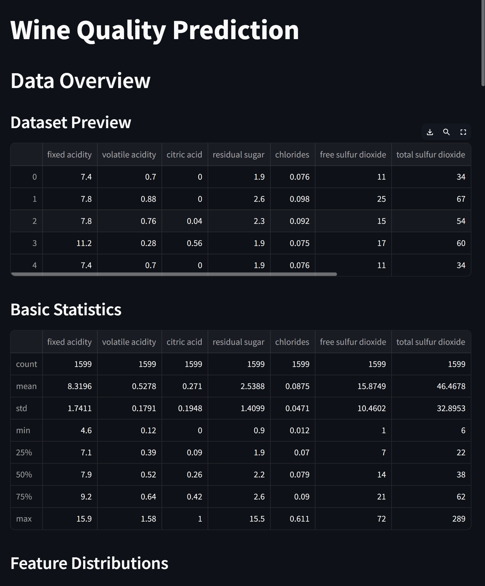
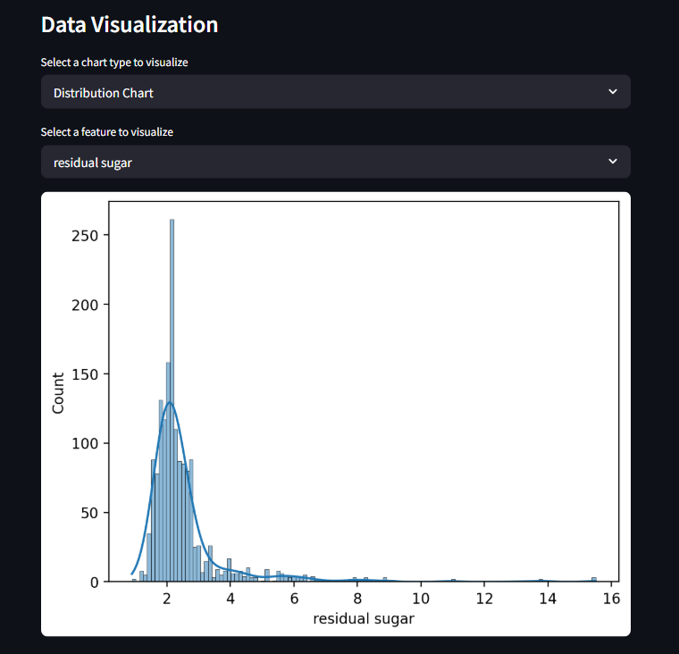
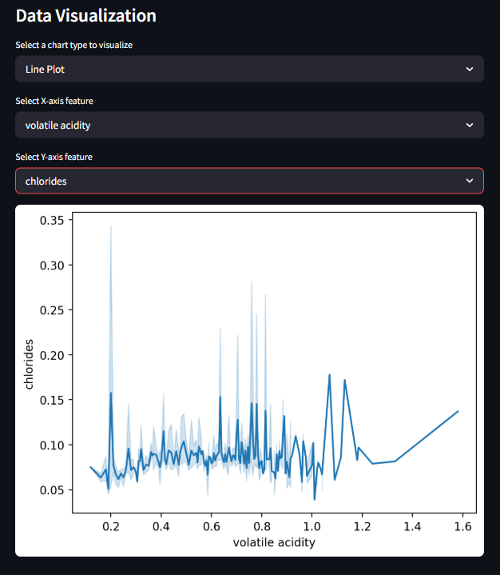
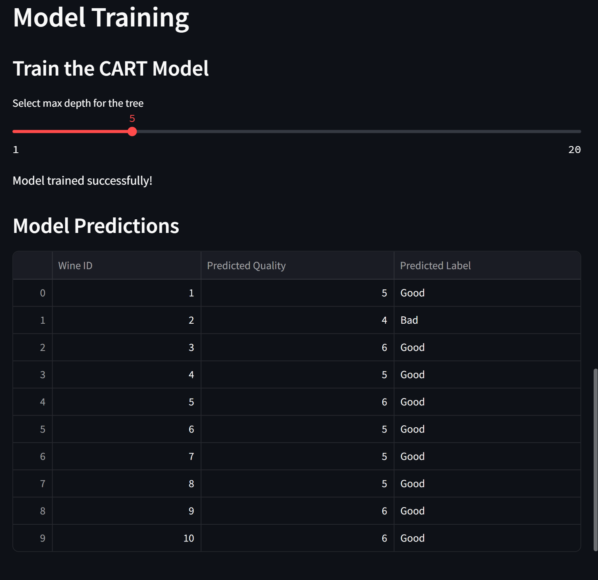
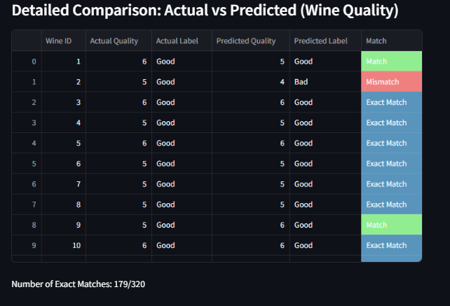
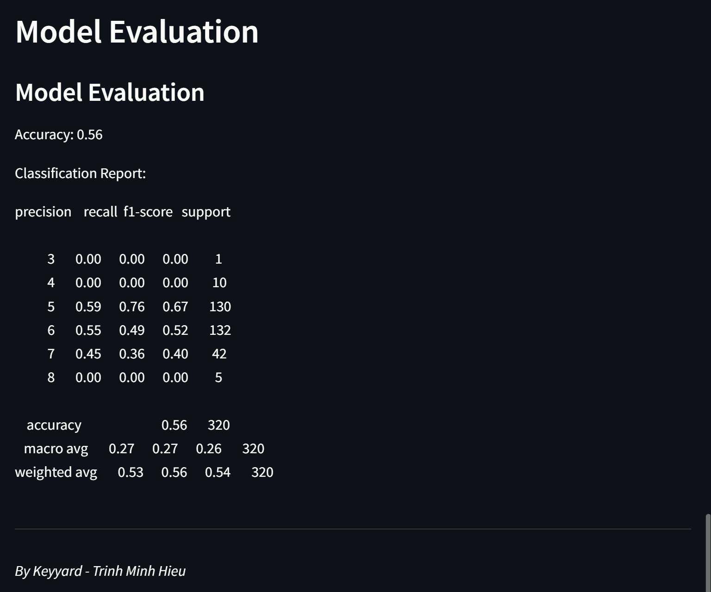

Đề tài 8: Nghiên cứu và cài đặt chương trình phần mềm sử dụng kỹ thuật cây quyết định **CART** để dự đoán chất lượng (quality) của các loại rượu theo các biến còn lại. Từ kết quả phân lớp và dữ liệu trong tập test, hãy đánh giá hiệu quả của mô hình dự đoán.

# How CART Algorithm Works

**CART (Classification and Regression Trees)** is a decision tree algorithm used for both classification and regression tasks. It works by splitting the dataset into subsets based on feature values, creating a tree structure where each node represents a decision rule. 

---
# Workflow
1. load data: Import the dataset containing wine quality and its physicochemical properties.
2. Visualize: Display feature distributions and correlations to understand the dataset.
3. Train model: Use the training set to train the CART model.
4. Predict: Predict wine quality using the trained model.
5. Compare Result: Check predictions against actual values and display a detailed comparison table.
6. Evaluate: Display accuracy and other evaluation metrics to assess model performance.

# TechSack:
Language: Python
Libs: 
Scikit-learn: For implementing CART and evaluating the model.
Pandas: For data manipulation.
Matplotlib/Seaborn: For visualizations.
StreamLit: For creating a web app interface.

Target variable: quality (1-10)
Features: fixed acidity, volatile acidity, citric acid, residual sugar, chlorides, free sulfur dioxide, total sulfur dioxide, density, pH, sulphates, alcohol.

# ScreenShots:







# Usage:
1. Clone the repository.
2. Install the required libraries using `pip install -r requirements.txt`.
3. Run 
```
streamlit run main.py
```

# References:
- [Streamlit Documentation](https://docs.streamlit.io/)
- [Pandas Documentation](https://pandas.pydata.org/)
- [Matplotlib Documentation](https://matplotlib.org/)
- [Seaborn Documentation](https://seaborn.pydata.org/)
- [Scikit-learn Documentation](https://scikit-learn.org/stable/)
- [CART Algorithm](https://scikit-learn.org/stable/modules/tree.html)
- Wine Quality Dataset from NEU LMS
